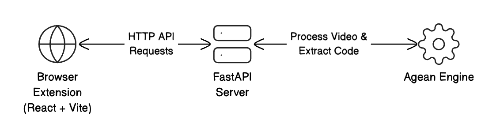

# Agean 🐙
A software application that extracts source code from programming tutorial videos.

## Overall System Design


## How to run
- Create a virtual environment using the command

```bash
python3 -m venv <name_of_venv>
```

- Install all dependencies using: 

```bash
pip install -r requirements.txt
```

- Run the `main.py` file

```bash
python3 main.py
```

## TODO
- [x] figure out how to extract other details from the video and then put it into an object
- [x] separate the video into frames
- [ ] read SIFT documentation and use it to remove duplicate frames

