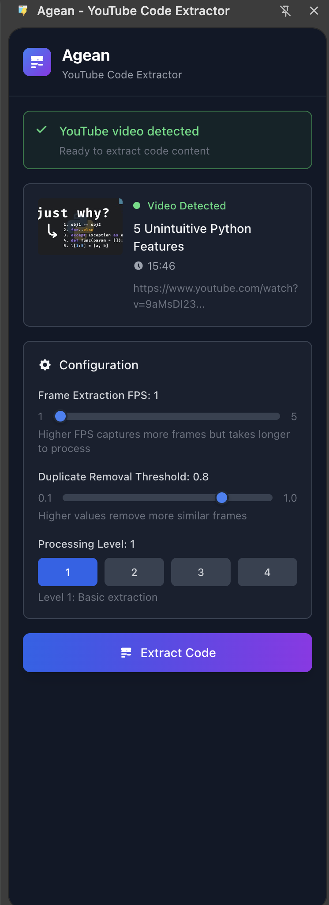

# Agean 🐙

A software application that extracts source code from programming tutorial videos.

It has three different parts:
- The engine which is the core of how everything works that is built with the event pipeline 
- The server which serves the engine as a REST API that can be used with whatever frontend you want.
- The browser extension which uses the server to extract code from whatever youtube video you're currently watching.

## Agean Demo
<iframe width="560" height="315" src="https://www.youtube.com/embed/URtZSVQESsM" title="YouTube video player" frameborder="0" allow="accelerometer; autoplay; clipboard-write; encrypted-media; gyroscope; picture-in-picture" allowfullscreen></iframe>

## Agean Engine


## Overall System Design 


## Browser Extension in Action




## How to run Server

- Create a virtual environment using the command

```bash
python3 -m venv src/venv/bin/activate
```

- Install all dependencies using:

```bash
pip install -r requirements.txt
```

- Run the `main.py` file

```bash
python3 main.py
```

NB: you will need an env file that contains information about the LLM and then 
Google Cloud for OCR related tasks.

## How to run Browser Extension
```bash
npm run dev

```
NB: None of this is deployed as it was for eductional purposes to the browser extension is tied to the server 
that runs locally.

